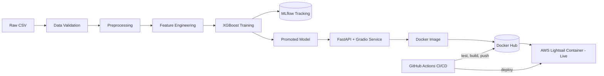

# Telecommunication Customer Churn Prediction

An end-to-end **MLOps** project that predicts whether a telecom customer will churn — built from raw data all the way to a live, containerised service running on AWS, with automated testing, image builds, and deployment.

[](https://github.com/Saheed7/telecommunication-customer-churn-prediction/actions/workflows/ci.yml)


> **Live demo:** the containerised service was deployed on AWS Lightsail at a public HTTPS endpoint serving the Gradio UI (`/ui`), and interactive docs (`/docs`). See the screenshots in [`images/`](images/).

---

## Overview

Customer churn — when a subscriber cancels their service — is one of the most expensive problems in telecom, because acquiring a new customer costs far more than retaining an existing one. This project builds a model that flags customers likely to churn **early enough for the business to intervene** (a discount, a retention call, a better plan).

The goal was not just a model in a notebook, but a **production-style ML system**: reproducible training, experiment tracking, a served API with a web UI, containerisation, continuous integration/deployment, and a live cloud deployment.

**Dataset:** IBM Telco Customer Churn — 7,043 customers, 20 features, ~26.5% churn rate (class-imbalanced).

---

## Architecture



**Design principle — train/serve consistency:** the exact preprocessing and feature-engineering steps used in training are reused at serving time, and the trained model's feature-column order is saved alongside it, so a live request is encoded identically to how the model was trained.

---

## Tech stack

| Layer | Tools |
|---|---|
| **Data & modelling** | pandas, scikit-learn, XGBoost |
| **Hyperparameter tuning** | Optuna (TPE sampler, 30 trials, cross-validated ROC-AUC) |
| **Experiment tracking** | MLflow |
| **Serving** | FastAPI (REST API), Gradio (web UI), Uvicorn (ASGI server) |
| **Testing** | pytest |
| **Containerisation** | Docker, published to Docker Hub |
| **CI/CD** | GitHub Actions (automated test to build to push to deploy) |
| **Cloud** | AWS Lightsail Containers (public HTTPS endpoint) |

---

## Project structure

```
telecommunication-customer-churn-prediction/
├── data/
│   └── raw/                      # Telco-Customer-Churn.csv (gitignored)
├── notebooks/
│   └── 01_exploratory_data_analysis.ipynb
├── scripts/
│   └── export_model.py           # promotes the best MLflow run to models/production
├── src/
│   ├── data/
│   │   ├── load_data.py
│   │   └── preprocess.py
│   ├── features/
│   │   └── build_features.py
│   ├── models/
│   │   ├── train.py              # trains XGBoost, logs to MLflow
│   │   └── tune.py               # Optuna hyperparameter search
│   ├── serving/
│   │   └── inference.py          # loads promoted model, runs predictions
│   ├── utils/
│   │   └── validate_data.py      # data-quality gate
│   └── app/
│       ├── main.py               # FastAPI app (/, /predict) + mounted Gradio UI (/ui)
│       └── gradio_ui.py
├── models/
│   ├── production/               # the promoted, served model
│   └── best_params.json          # tuned hyperparameters
├── tests/
│   ├── test_pipeline.py
│   └── test_prediction.py
├── .github/workflows/ci.yml      # CI/CD pipeline
├── Dockerfile
├── requirements.txt
└── README.md
```

---

## Key results

The model is deliberately optimised for **recall** and **ROC-AUC** rather than raw accuracy, because on an imbalanced churn problem the costly mistake is *missing a customer who leaves*, not a false alarm. Hyperparameter tuning with Optuna improved the model over a hand-tuned baseline:

| Metric | Baseline | Tuned |
|---|---|---|
| ROC-AUC | 0.837 | **0.849** |
| Recall (churn) | 0.762 | **0.807** |
| F1 (churn) | 0.625 | **0.626** |
| Precision (churn) | 0.530 | 0.511 |

The tuned model catches **~81% of customers who actually churn**. Class imbalance is handled with XGBoost's `scale_pos_weight`, and all 30 tuning trials are tracked in MLflow for comparison.

Key drivers of churn surfaced in the [EDA](notebooks/01_exploratory_data_analysis.ipynb): **month-to-month contracts, fibre-optic internet, electronic-check payment, low tenure, and the absence of add-on services** (online security, tech support).

---

## Running it locally

**Prerequisites:** Python 3.11 (Anaconda recommended), Docker Desktop (optional, for the container).

```bash
# 1. Clone and enter the repo
git clone https://github.com/Saheed7/telecommunication-customer-churn-prediction.git
cd telecommunication-customer-churn-prediction

# 2. Create an isolated environment and install pinned dependencies
conda create -n telco-churn python=3.11 -y
conda activate telco-churn
pip install -r requirements.txt

# 3. Place the dataset at data/raw/Telco-Customer-Churn.csv
#    (IBM Telco Customer Churn dataset, publicly available)

# 4. Train the model (logs to MLflow, saves to mlruns/)
python -m src.models.train

# 5. (Optional) tune hyperparameters, then retrain
python -m src.models.tune
python -m src.models.train

# 6. Promote the trained model for serving
python -m scripts.export_model

# 7. Run the service
python -m uvicorn src.app.main:app --reload
```

Then open:
- `http://127.0.0.1:8000/ui` — Gradio web form
- `http://127.0.0.1:8000/docs` — interactive API docs
- `http://127.0.0.1:8000/predict` — JSON prediction endpoint

**Run the tests:**
```bash
python -m pytest -v
```

**View experiment tracking:**
```bash
mlflow ui --backend-store-uri ./mlruns
```

---

## API usage

`POST /predict` accepts one customer record and returns a churn prediction:

```json
{
  "gender": "Female", "SeniorCitizen": 0, "Partner": "Yes", "Dependents": "No",
  "tenure": 2, "PhoneService": "Yes", "MultipleLines": "No",
  "InternetService": "Fiber optic", "OnlineSecurity": "No", "OnlineBackup": "No",
  "DeviceProtection": "No", "TechSupport": "No", "StreamingTV": "No",
  "StreamingMovies": "No", "Contract": "Month-to-month", "PaperlessBilling": "Yes",
  "PaymentMethod": "Electronic check", "MonthlyCharges": 70.35, "TotalCharges": 140.70
}
```

Response:
```json
{ "churn_prediction": 1, "churn_probability": 0.68, "label": "Will churn" }
```

---

## Docker

The service is fully containerised and published to Docker Hub. Run it anywhere:

```bash
docker run -p 8000:8000 kayodenet/telco-churn-app:latest
```

Then open `http://127.0.0.1:8000/ui`. The container carries only the promoted production model — not the full experiment history — keeping the image focused on serving.

---

## CI/CD pipeline

Every push to `main` triggers an automated [GitHub Actions](.github/workflows/ci.yml) pipeline that:

1. **Tests** — runs the pytest suite on a clean Ubuntu runner (proving reproducibility from scratch).
2. **Builds** — builds the Docker image from the `Dockerfile`.
3. **Publishes** — pushes the image to Docker Hub (credentials stored as encrypted GitHub Secrets).
4. **Deploys** — triggers a new deployment on AWS Lightsail so the live service updates automatically.

Each stage only runs if the previous one passes, so broken code never reaches production.

---

## Deployment & architecture (AWS)

The container was deployed on **AWS Lightsail Containers** (Micro tier), which pulls the public Docker Hub image directly and provides a managed, load-balanced **HTTPS endpoint** with health checking — no manual server, networking, or certificate management.

- **Health check** (`/`) confirms the service is alive.
- **Web UI** (`/ui`) — an interactive Gradio form anyone can use to score a customer.
- **API** (`/predict`) and **docs** (`/docs`) exposed on the same endpoint.

Screenshots of the live deployment are in [`images/`](images/).

> Note: the live URL was kept online for a demonstration period and then torn down to avoid ongoing cost. The screenshots and this documentation preserve the deployment as a permanent artifact, and the service can be redeployed at any time with a single `docker run` or a push to `main`.

---
## Roadblocks & how we solved them
uvicorn --reload couldn't import project modules
- Cause: the reloader spawns a worker process that resolved a different Python than the active environment.
- Fixes: launched the server with python -m uvicorn src.app.main:app to force the active interpreter.

500 error at /predict: ['customerID'] not found in axis
- Cause: the shared preprocessing step dropped customerID, but live API requests don't include that column — so training and serving fed the function different inputs.
- Fixes: made the drop tolerant with df.drop(columns=["customerID"], errors="ignore"), keeping a single preprocessing path for both training and serving (train/serve consistency).

MLflow refused the local file store / invalid file:// URI on Windows (MlflowException: ... maintenance mode, not a valid remote uri)
- 	Cause: newer MLflow disables the local mlruns/ store by default, and a hand-built file://{path} string produced an invalid URI on Windows (backslashes, a space in the path, and the drive letter read as a network host).
- Fixes: set MLFLOW_ALLOW_FILE_STORE=true; built the tracking URI with pathlib.Path.as_uri() instead of an f-string; pinned MLflow to a stable 2.16.2.

Docker build failed on the Linux CI runner from the lock file
- Cause: requirements-lock.txt was generated by pip freeze on Windows and contained Windows-only packages (e.g. pywin32) that can't install on Linux.
- Fix: built the container from the curated, cross-platform requirements.txt and excluded the lock file via .dockerignore.
---
## Possible next steps
- Introduce **versioned image tags** (instead of `latest`) for stricter release control.
- Wrap validation in **Great Expectations** for a formal data-contract layer.
---

## Author

**Yakub Kayode Saheed** — Machine Learning/AI Engineer
GitHub: [@Saheed7](https://github.com/Saheed7) · Docker Hub: [kayodenet](https://hub.docker.com/u/kayodenet). Google Scholar: https://scholar.google.com/citations?user=faYh6iIAAAAJ 
